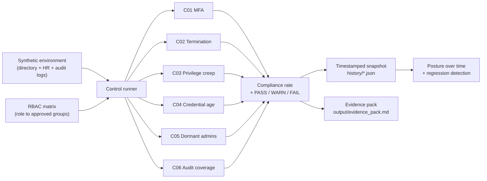

# HIPAA Continuous Control Monitoring

**Automated, scheduled evaluation of HIPAA Security Rule technical controls against a
synthetic clinic directory — with scored posture, audit-ready evidence, and history.**

Most clinics assess their security posture once a year, then drift for eleven months.
When an auditor asks for evidence, someone spends a week assembling screenshots. This
runs the checks on a schedule and produces the evidence automatically.

> **Synthetic data only.** The directory, HR roster, and audit logs are generated. No
> real identities, credentials, or PHI appear anywhere in this repository.

## What it does

Six technical controls are evaluated on every run. Each is mapped to its **HIPAA Security
Rule citation** and **NIST CSF 2.0 subcategory**, scored as a compliance rate, and rolled
into an overall posture score. Every run writes a timestamped snapshot, so posture is
tracked over time rather than at a single point.

| ID | Control | HIPAA | NIST CSF 2.0 |
|---|---|---|---|
| C01 | MFA on ePHI-access accounts | 164.312(d) | PR.AA-03 |
| C02 | Accounts disabled on termination | 164.308(a)(3)(ii)(C) | PR.AA-01 |
| C03 | Group membership within RBAC | 164.308(a)(4) | PR.AA-05 |
| C04 | Password rotation within 90 days | 164.308(a)(5)(ii)(D) | PR.AA-01 |
| C05 | Privileged accounts not dormant | 164.308(a)(4)(ii)(B) | PR.AA-05 |
| C06 | Audit log coverage on ePHI systems | 164.312(b) | DE.CM-09 |

Full definitions, populations, and scoring thresholds: [`docs/control_catalog.md`](docs/control_catalog.md).

## Architecture



Every control returns the same `ControlResult` shape, so scoring, the evidence pack, and
trend analysis never special-case a control — adding a seventh requires no downstream
changes.

## Tech stack

Python 3.12 — **standard library only**; `pytest` is the single dependency and only the
test suite needs it. Charting is hand-written SVG rather than a plotting library, so CI
stays fast and output diffs cleanly in git. GitHub Actions runs the suite and the
evaluation weekly. No third-party service touches the data.

## Setup

```bash
git clone https://github.com/elazarf123/hipaa-continuous-control-monitoring.git
cd hipaa-continuous-control-monitoring
pip install -r requirements.txt

pytest tests/ -q          # 17 tests across controls, exceptions, and trend analysis
python src/run_monitor.py # evaluate posture, write snapshot + evidence pack
python src/trend.py       # posture over time + regression report
```

Output goes to `history/<timestamp>.json`, `output/evidence_pack.md`, and
`output/posture_trend.svg`.

## Sample run

```
Posture score: 33.3%
  [FAIL] C01    80.5%   8 finding(s)  MFA on ePHI-access accounts
  [PASS] C02   100.0%   0 finding(s)  Accounts disabled on termination
  [WARN] C03    90.9%   7 finding(s)  Group membership within RBAC
  [FAIL] C04    50.6%  38 finding(s)  Password rotation within 90 days
  [FAIL] C05    40.0%   9 finding(s)  Privileged accounts not dormant
  [WARN] C06    94.6%   3 finding(s)  Audit log coverage on ePHI systems
```

The synthetic environment has control failures deliberately planted, so the tool has
something to find. A clean run would prove nothing.

## Measured behaviour

Rather than estimated ROI, these are numbers this repo actually produces:

- **6 controls** evaluated across an **80-account** directory and a **14-day** audit-log
  window in **under one second** on a standard runner.
- **65 findings** surfaced in the reference environment, each carrying its account, the
  specific failure, a severity, and the citation it violates.
- **Reproducible**: the environment is seeded, so posture changes come from control logic
  rather than from random data.
- **17 tests** covering control behaviour, exception expiry and scoping, and regression
  detection — including that an exception for one control must not suppress another's.

What this replaces is a manual review: pulling a directory export, cross-referencing an
HR roster and an RBAC matrix by hand, and eyeballing log coverage. I have not measured a
real clinic's baseline for that work, so I am not going to claim a percentage saved.

## Risk exceptions

Real environments have accepted risks. `exceptions.json` suppresses a specific finding for
a specific control — and **every entry requires an expiry date**; loading one without
`expires_on` raises `ValueError`. Expired exceptions stop suppressing automatically and
are reported on the next run, so an accepted risk cannot quietly become permanent.

## Trend analysis

Each run appends a timestamped snapshot, so posture is tracked over time rather than at a
single point. `src/trend.py` reports any control whose compliance rate dropped:

```
Snapshots: 3  |  latest posture: 25.0%
Regressions since previous run:
  C02  100.0% -> 93.8%  (-6.2%)  Accounts disabled promptly on termination
  C01   80.5% -> 78.3%  (-2.2%)  MFA on ePHI-access accounts
```

## Privacy and security guardrails

- **Synthetic data only** — generated directory, HR roster, and logs. No real identities,
  credentials, or PHI.
- **No third-party data egress** — everything runs locally or in the repo's own CI. No
  external API, cloud service, or LLM sees the data.
- **Read-only** — this tool assesses and reports. It never disables an account or changes
  a permission. Remediation stays a human decision.
- **Traceable** — every finding cites the HIPAA provision and NIST CSF subcategory it maps
  to, so a reviewer can follow the reasoning rather than trust the output.
- **Reproducible evidence** — snapshots are timestamped and committed, so any past
  assertion about posture can be re-derived.

## Repository structure

```
src/
  environment.py        # synthetic directory, HR roster, audit logs (seeded)
  run_monitor.py        # runs controls, scores posture, writes snapshot + evidence
  controls/
    base.py             # Control base class + ControlResult (shared result shape)
    c01_..._.py         # one module per control
  exceptions.py         # risk-exception register with mandatory expiry
  trend.py              # snapshot history, regression detection, SVG chart
tests/
  test_controls.py      # behavioural tests for every control
  test_exceptions.py    # suppression, expiry, control scoping, validation
  test_trend.py         # regression detection + chart rendering
docs/
  control_catalog.md    # control definitions, citations, scoring thresholds
  PYTHON_GUIDE.md       # code walkthrough and design rationale
exceptions.json         # accepted risks (expiry required)
history/                # timestamped posture snapshots
output/                 # generated evidence pack
.github/workflows/      # weekly scheduled run
```

## Skills demonstrated

HIPAA Security Rule interpretation · NIST CSF 2.0 control mapping · identity and access
governance (RBAC drift, joiner-mover-leaver, privileged access) · audit-log coverage
analysis · Python (dataclasses, properties, inheritance, set operations, generator
expressions, pathlib, type hints, plugin-style architecture) · pytest · CI/CD automation
with GitHub Actions · audit evidence generation

## Companion projects

The point-in-time version of this review is
[iam-access-review](https://github.com/elazarf123/iam-access-review); the log-based
detections are [phi-access-anomaly-detection](https://github.com/elazarf123/phi-access-anomaly-detection);
the framework assessment that defines these controls is
[nist-csf-hipaa-risk-assessment](https://github.com/elazarf123/nist-csf-hipaa-risk-assessment).
This repo turns those one-off assessments into continuous monitoring.
